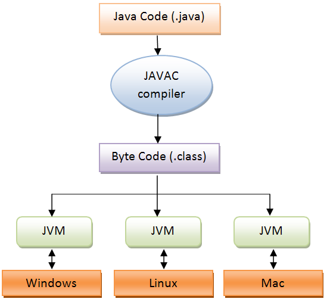

# Java

## Java란?
>Java는 썬 마이크로시스템즈(Sun Microsystems, Inc. 이하 썬)에서 개발하여 1996년 1월에 공식적으로 발표한 객체지향 프로그래밍 언어이다.
2010년에 썬이 오라클(oracle)사에 인수되면서 자바는 오라클사의 제품이 되었다.

## Java의 역사 
> 1991년에 썬의 엔지니어들에 의해서 고안된 오크(Oak)라는 언어에서부터 시작되었다.
> 제임스 고슬링과 아서 밴 호프와 같은 썬의 엔지니어들의 원래 목표는 가전제품에 탑재 될 소프트웨어를 만드는 것이었다. 처음에는 C++을 확장해서 사용하려 했지만 C++로는 그들의 목적을 이루기에 부족하다는 것을 깨닫고 C++의 장점을 도입하고 단점을 보완한 새로운 언어를 개발하기에 이르렀다.
Oak는 처음에는 가전제품이나 PDA와 같은 소형기기에 사용될 목적이었으나 여러 종류의 운영체제를 사용하는 컴퓨터들이 통신하는 인터넷이 등장하자 인터넷에 적합하도록 그 개발 방향을 바꾸면서 이름을 Java로 변경하였다.

## Java 언어의 특징

1. 운영체제에 독립적이다.

   Java 응용프로그램(application)은 운영체제나 하드웨어가 아닌 자바가상머신(JVM)하고만 통신하기 때문이다.

2. 객체지향언어이다.

   객체지향개념의 특징인 상속, 캡슐화, 다형성이 잘 적용된 순수지향 객체지향 프로그래밍언어(object-orientied programming language)라는 평가를 받고 있다.

3. 비교적 배우기 쉽다.

   연산자와 기본구문은 C++에서 객체지향관련 구문은 스몰톡(small talk)이라는 객체지향언어에서 가져오면서 이들 언어의 장점은 취하면서 복잡하고 불필요한 부분은 과감히 제거하여 단순화하였다.

4. 자동 메모리 관리(Garbage Collection)
   
   Java로 작성된 프로그램이 실행되면, 가비지컬렉터가 자동적으로 메모리를 관리해준다. 다소 비효율적인 면도 있지만, 프로그래머가 프로그래밍에 집중할 수 있도록 도와준다.

5. 네트워크와 분산처리를 지원한다.

   풍부하고 다양한 네트워크 프로그래밍 라이브러리(Java API)를 지원한다.

6. 멀티쓰레드를 지원한다.
   
   라이브러리가 제공되므로 구현이 쉬우며 쓰레드에 대한 스케줄링을(cheduling)을 자바 인터프리터가 담당하게 된다.

7. 동적 로딩(Dynamic Loading)을 지원한다.

   Java application은 여러 개의 클래스로 구성되어 있는데 실행 시에 모든 클래스가 로딩되지 않고 필요한 시점에 클래스를 로딩하여 사용할 수 있다. 또한 

##JVM(JAva Virtual Machine)
> Java를 실행하기 위한 가상 기계

<pre>

</pre>

참고자료
>https://medium.com/@ahn428/java-jvm-java-virtual-machine-jre-java-runtime-environment-jdk-java-developement-kit-fed91def1d6f
