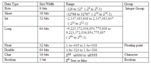

# 변수(variable)

## 변수란?
> 단 하나의 값을 저장할 수 있는 메모리 공간.

## 변수의 선언과 초기화
> 변수의 초기화: 변수를 사용하기 전에 처음으로 값을 저장하는 것
```
    int age;    // 변수타입: int, 변수이름: age, 변수의 값
```

## 변수의 명명규칙
```
1. 대소문자가 구분되며 길이에 제한이 없다.
  - True와 true는 서로 다른 것으로 간주된다.
  
2. 예약어를 사용해서는 안 된다.
  - true는 예약어라서 사용할 수 없지만, True는 가능하다.

3. 숫자로 시작해서는 안 된다.
  - top10은 허용하지만 7up은 허용되지 않는다.
  
4. 특수문자는 '_'와 '$'만을 허용한다.
  - $harp은 허용되지만, S#arp은 허용되지 않는다.
```
  
## 변수의 권장규칙
```
1. 클래스 이름의 첫 글자는 항상 대문자로 한다
  - 변수와 메서드의 이름의 첫 글자는 항상 소문자로 한다.
  
2. 여러 단어로 이루어진 이름은 단어의 첫 글자를 대문자로 한다.
  - lastIndexOf, StringBuffer
  
3. 상수의 이름은 모두 대문자로 한다. 여러 단어로 이루어진 경우 '_'로 구분한다.
  - PI, MAX_NUMBER
```

* 변수의 이름
>짧을수록 좋지만 약간 길더라도 용도를 알기 쉽게 `의미있는 이름`으로 작성하자.
변수의 선언문에 주석으로 변수에 대한 정보를 주는 것도 좋은 방법이다.
```
    int curPos = 0;     // 현재 위치(current position)
    int lastPos = -1;   // 마지막 위치(last position)
```

# 변수의 타입
```
기본형(primitive type)
  - 논리형(boolean), 문자형(char), 정수형(byte, short, int, long), 실수형(float, double)
    계산을 위한 실제 값을 저장한다. 모두 8개

참조형(reference type)
  - 객체의 주소를 저장한다. 8개의 기본형을 제외한 나머지 타입.
```

## 기본형(primitive type)
<pre>
    
</pre>

# 진법


> 참고

* http://www.learnerschoice.in/java-primitive-data-types-and-its-ranges/datatypes/