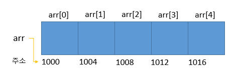

# 배열(array)

## 1. 배열

### 1.1 배열이란?
```text
같은 타입의 여러 변수를 하나의 묶음으로 다루는 것
```



변수와 달리 배열은 각 저장 공간이 연속적으로 배치되어 있다는 특징이 있다.

### 1.2 배열의 선언과 생성

* 배열의 선언
```java
    int[] score;     or     int score[];
    String[] name;   or     String name[];       
```
대괄호가 변수 이름의 일부라기보다는 타입의 일부라고 보기 때문에 타입에 대괄호를 붙이는 것을 선호한다.

* 배열의 생성
```java
    score = new int[5];
    name = new String[5];
```
연산자 `new`와 함께 배열의 타입과 길이를 지정해 주어해 주어야 한다.

* 배열의 선언과 생성
```java
    int[] score = new int[5];
    String[] name = new String[5];
```

### 1.3 배열의 길이와 인덱스

* 배열의 인덱스
배열의 각 저장공간을 `배열의 요소(element)`, `배열이름[인덱스]`의 형식으로 배열의 요소에 접근한다.

인덱스(index)
`배열의 요소마다 붙여진 일련번호`로 각 요소를 구별하는데 사용된다.
인덱스의 범위는 0부터 배열길이 -1까지이다

배열은 index로 상수 대신 변수나 수식도 사용할 수 있다는 장점도 있다.
```java
score[0] = 0;                       
score[1] = 10;              for (int i=0; i < 5; i++) {
score[2] = 20;      =>          score[i] = i * 10;  
score[3] = 30;              }
score[4] = 40;
```
        유효한 범위를 벗어난 값을 index로 사용하는 경우 컴파일러는 걸러주지 못한다. 
        그 이유는 index로 변수를 많이 사용하는데 변수의 값은 실행 시에 대입되므로 
        컴파일러는 이 값의 범위를 확인할 수 없다.
        이런 경우 실행 시에 에러 ArrayIndexOutOfBoundsException이 발생한다.

* 배열의 길이
배열의 길이는 int 범위의 양의 정수(0도 포함)이어야 한다.

배열이름.length
자바에서는 JVM이 모든 배열의 길이를 별도로 관리하여, `배열이름.length`를 통해서 배열의 길이를 얻을 수 있다.
```java
int[] arr = new int[5];
int temp = arr.length;
```
배열은 한번 생성한 길이를 변경할 수 없기 때문에 배열 길이는 상수이며, 값을 읽을 수만 있지 변경할 수는 없다.
```java
int[] arr = new int[5];
arr.length = 10;            // Error
```

배열의 길이 변경하기
1. 더 크 배열을 새로 생성한다.
2. 기존 배열의 내용을 새로운 배열에 복사한다.

이 작업들은 비용이 많이 들기 때문에, 처음부터 배열의 길이를 넉넉하게 잡아 이런 상황이 가능한 적게 발생하도록 해야한다.
그렇다고 배열의 길이를 너무 크게 잡으면 메모리를 낭비하므로, 기존의 2배정도의 길이로 생성하는 것이 좋다.

### 1.4 배열의 초기화
배열은 생성과 동시에 자동적으로 자신의 타입에 해당하는 기본값으로 초기화된다.

원하는 값을 저장하려면
```java
int[] score = new int[5];

// 1. 직접 대입
score[0] = 50;
score[1] = 60;
score[2] = 70;
score[3] = 80;
score[4] = 90;

// 2. 일정한 규칙이 있다면 for문 대입
for (int i=0; i < score.length; i++)
    score[i] = i * 10 + 50;

// 3. 일정한 규칙이 없을 시에는 아래와 같이 적용 가능 (배열의 길이는 {} 안의 갯수로 자동 결정)
int[] score = new int[] { 50, 60, 70, 80, 90 };
int[] score = { 50, 60, 70, 80, 90 };       // 생성과 동시에 초기화시 new int[]를 생략 가능
score = { 50, 60, 70, 80, 90 };             // Error
score = new int[] { 50, 60, 70, 80, 90 };   // OK

// 메서드의 매개변수가 배열인 경우
int add(int[] arr) {}                       
int result = add(new add[] { 100, 90, 80, 70, 60 }); // OK
int result = add({ 100, 90, 80, 70, 60 });           // Error

// 길이가 0인 배열
int[] score = new int[0];
int[] score = new int[];
int[] score = {};
```
* 배열의 출력
`Arrasy.toString(배열이름)` 메서드를 사용 배열의 내용을 쉽게 확인할 수 있다.
`[첫번째 요소, 두번째 요소, ...]`와 같은 형식의 문자열을 반환한다.
배열의 값을 바로 출력하면 `배열의 주소`가 `타입@주소` 형식으로 출력된다.
ex) [I@141318bb
'[I'는 1차원 int배열이라는 의미이며 '@' 뒤에 나오는 16진수는 배열의 주소인데 실제 주소가 아닌 내부 주소이므로
실행할 때마다 변경될 수 있다. 

### 1.5 배열의 복사
배열의 복사 방법
1. for문 이용 [ ArrayEx3.java ]
```java
    int[] arr = new int[5];
            ...
    int[] tmp = new int[arr.length*2];  // 기존 배열보다 길이가 2배인 배열 생성
    for (int i=0; i < arr.length; i++)
        tmp[i] = arr[i];                // arr[i]의 값을 tmp[i]에 저장
    arr = tmp;                          // 참조변수 arr이 새로운 배열을 가르키게 한다.
```

배열은 참조변수를 통해서만 접근할 수 있기 때문에 자신을 가르키는 참조변수가 없는 배열은 사용할 수 없다.
이렇게 쓸모없게 된 배열은 JVM의 가비지 컬렉터에 의해 자동적으로 메모리에서 제거된다.

2. System.arraycopy() [ ArrayEx4.java ]
> 배열의 복사는 for문보다 System.arraycopy()를 사용하는 것이 효율적이다.

for문은 배열의 요소 하나하나에 접근해서 복사하지만, arraycopy()는 지정된 범위의 값들을 한 번에 통째로 복사한다.
각 요소들이 연속적으로 저장되어 있다는 배열의 특성때문에 이런 처리가 가능한 것이다. 

다른 배열과 달리 char배열은 for문을 사용하지 않고도 print(), println()으로 배열에 저장된 모든 문자를 출력할 수 있다.

### 1.6 배열의 활용
[ ArrayEx5 ~ ArrayEx11.java ]

## 2. String배열

### 2.1 String배열의 선언과 생성
```java
String[] name = new String[3];
```
참조형 변수의 기본 값은 null이므로 각 요소의 값은 null로 초기화 된다. 
( null은 어떠한 객체도 가리키고 있지 않다는 뜻이다. ) 

### 2.2 String배열의 초기화
```java
String[] name = new String[3];
name[0] = "Kim";
name[1] = "Park";
name[2] = "Yi";
String[] name = new String[] {"Kim", "Park", "Yi"};
String[] name = { "Kim", "Park", "Yi" };    // new String[]을 생략할 수 있음.
```
`String` 클래스만 `new` 연산자를 생략할 수 있다.
참조형 변수를 간단히 참조변수라고도 하며, 모든 참조형 변수에는 객체가 메모리에 저장된 주소인 4 byte의 정수값(0x0 ~ 0xffffffff) 또는 null이 저장된다.

### 2.3 char배열과 String클래스
```text
String 클래스는 char 배열에 기능(메서드)을 추가한 것이다.
```
char 배열과 String 클래스의 한 가지 중요한 차이
String 객체(문자열)는 읽을 수만 있을 뿐 내용을 변경할 수 없다.
```java
String str = "Java";
str = str + 8;              // "Java8"이라는 새로운 문자열이 str에 저장된다.
System.out.println(str);    // "Java8"
```
변경 가능한 문자열을 다루려면, `StringBuffer` 클래스를 사용하면 된다.

#### String 클래스의 주요 메서드
... 

### 2.4 커맨드 라인을 통해 입력받기


# 3. 다차원 배열

### 3.1 2차원 배열의 선언과 인덱스

### 3.2 2차원 배열의 초기화

### 3.3 가변 배열

### 3.4 다차원 배열의 활용


## 참고 자료
* https://goandroidtips.com/blog/%ED%8F%AC%EC%9D%B8%ED%84%B0-%EB%B0%B0%EC%97%B4-%EA%B4%80%EA%B3%84/