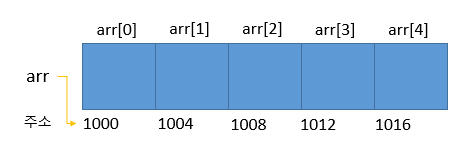

# 배열(array)

## 1. 배열

### 1.1 배열이란?
```text
같은 타입의 여러 변수를 하나의 묶음으로 다루는 것
```



변수와 달리 배열은 각 저장 공간이 연속적으로 배치되어 있다는 특징이 있다.

### 1.2 배열의 선언과 생성

* 배열의 선언
```java
    int[] score;     or     int score[];
    String[] name;   or     String name[];       
```
대괄호가 변수 이름의 일부라기보다는 타입의 일부라고 보기 때문에 타입에 대괄호를 붙이는 것을 선호한다.

* 배열의 생성
```java
    score = new int[5];
    name = new String[5];
```
연산자 `new`와 함께 배열의 타입과 길이를 지정해 주어해 주어야 한다.

* 배열의 선언과 생성
```java
    int[] score = new int[5];
    String[] name = new String[5];
```

### 1.3 배열의 길이와 인덱스


### 1.4 배열의 초기화


### 1.5 배열의 복사


### 1.6 배열의 활용


## 2. String배열

### 2.1 String배열의 선언과 생성

### 2.2 String배열의 초기화


### 2.3 char배열과 String클래스

### 2.4 커맨드 라인을 통해 입력받기


# 3. 다차원 배열

### 3.1 2차원 배열의 선언과 인덱스

### 3.2 2차원 배열의 초기화

### 3.3 가변 배열

### 3.4 다차원 배열의 활용


## 참고 자료
* https://goandroidtips.com/blog/%ED%8F%AC%EC%9D%B8%ED%84%B0-%EB%B0%B0%EC%97%B4-%EA%B4%80%EA%B3%84/